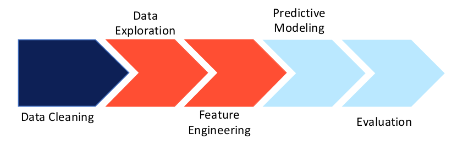
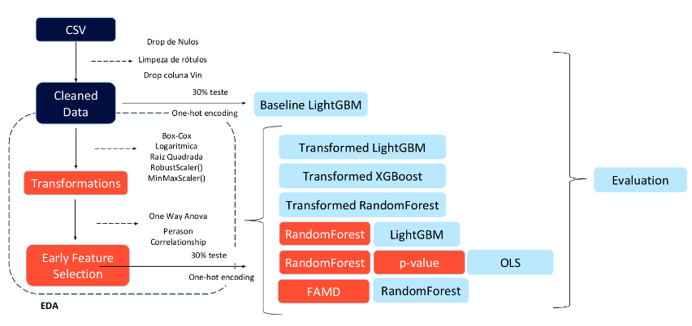
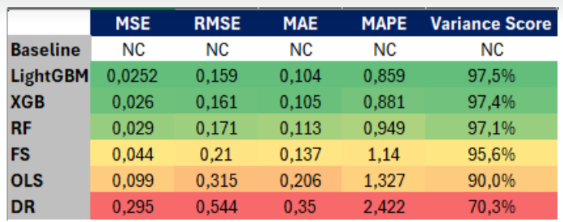

# Car-Prices-Project

This project has two main objectives: 
  1. Predict car prices based on categorical and continous features given by a public dataset of Kaggle on `car_prices.csv`. It aims to explore pre-processing techniques and predictors comparison, being found on `Projeto_Car_Prices.ipynb`
  2. Give a profiling inteface to discover data easily through streamlit.

**Disclaimer:** There's a lot to improve on both topics. That improvements may include DBT and Great Expectations, for instance.

 ## 1. Insatallation
 This section covers Windows installation

1. Be positive you have your python installed and git configured :)
2. `pip install virtualenv`
3. `python3.10 -m venv .venv-name`
4. `.venv-name\Scripts\activate.bat`
5. `pip install -r requirements.txt`

## 2. Execution

1. To execute the streamlit application just activate the venv, go to the project root path and type
- `streamlit run streamlit/profiling.py`
- open the localhost port indicated

2. The prediction study can be seen in the jupyter notebook. Since you have it all installed in you venv, I suggest configuring VSCode with jupyter extension with the proper kernel.

* Case executed in colab, uncomment: `#from google.colab import files` on imports and read_csv logic
* Be careful with execution that will train models again and save on .pkl files

## 3.Details 
This section will further explain the project structure for both objectives: (1) and (2).

### (1) **Jupyter Notebook EDA for predicting Car Prices**

As first groundrules I'll point out some of the project's main premisses.
1. It will try to predict the car sellingprice as the dependent variable based on other features.
2. Not assumed mandatory assumptions for linear regression, even though tested for understanding and feature transformations/selection
    - Linear Relationshipt between features and 'y';
    - Homoscendasticity;
    - Residual normal distribution;
    - Low multicolinearity;

Below is pictured the macro steps used on the project development, aswell.
### 1. First, given the CSV file downloaded on Kaggle, there was a cleaning step that concerned on dealing with
    - Data Completeness;
    - Null Handling;
    - Parsing Dates;
    - Data Validity;
    - Categorical Treatment;

### 2. On a second moment, happend the pre-processing step, divided into two:
    - 2.1. Data Exploration
    - 2.2. Feature Engineering

The main purpose of this step was to understand the data and potential transormations needed, besides data that should be dropped on feature selection. It tackles:
 - Balancing and Distribution of features;
 - Feature Transformations;
 - Correlationship;
 - Anova;
 - Others;

### 3. The third and fourth steps will be divided into two, but both deal with the modeling itself. On third will be explained the models archictectures and fourth the metric evaluations.

As shown in diagram below, 7 simple models were explored in order to get the best prediction. They used mainly boosting ensembles and decision trees to deal with the model prediction, however with different approaches.

1. This was the **baseline** model results. It was applied a boosting model that is quite fast, the **LightGBM**, with the original features cleaned and one-hot enconded 
2.  **Transformed LighGBM** is the same model explained in (1) as baseline, but with transformed features; 
3.  **Transformed XGBoost** is the application of XGboost boosting ensemble with the transformed features; 
4.  **Transformed RandomForest** is the application of the decision tree RandomForest with the transformed features; 
5.  **RandomForest + LightGBM** is the application of a RandomForest in order to make the feature selection based on feature importance of the model. This features were used as input of the LightGBM model for prediction; 
6.  **OLS Feature Selection** 
7.  **FAMD+RandomForest** is the application of Dimension Reduction for continuous and categorical variables - Factor Analysis of Mixed Data - to reduce the number of features and use it as input for the RandomForest model;

*obs.:Architectures (2) to (7) uses the same pre-processing steps.

### 4. Evaluation metrics

To compare the model results, besides plotting it, each model was evaluated based on 5 metrics below:
- MSE : Mean Squared Error
- RMSE : Root Mean Squared Error
- MAE: Mean Absolute Error
- MAPE: Mean Absolute Percentual Error
- Variance Score

And the final results can bee seen in the below image. 

### (2) **Profiling Data with Streamlit**

This is a simpler explanation of the accomplished. Basically it is the first attempt of dealing with providing an application based on Streamlit to actually visualize the insights being found. 
In order to do so, were created two pages:
- profiling
- EDA

The first one uses the ydata_profiling and streamlit_padas_profiling to make a customized profiling report of the dataset. 

The second one deals with exploring the features discovery and transformation.

Besides that there's a page that concentrates on the new possibible explorations on this naive application.

### The best way to better understand is to clone the repository and try it yourself!

## 4. Next Steps
This section concerns the possible explorations regarding the models and application

1.  Explore the Outliers handling based on "There's No Free Lunch" maxima;
2.  Explore different categorical encoding, ideally Target Encoding
3.  Explore other balancment techniques, such as 
    a. SMOTE
    b. Re-sampling
    c. K-fold
    d. Penalization Strategy
    e.FDS (Feature Distribution Smoothening)
4.  Better explore RFE (recursive) for feature selection
5.  Improve Dimensionality Reduction
6.  Hyoerparameter Tuning on GridSearch
7.  Model productization (API) and inclusion in the application
8.  Fix in the EDA application page bugs
9.  Dockerization of postgresql to use it
10.  DBT and Great Expectations
11.  General front improvement, such as overview with Github page

